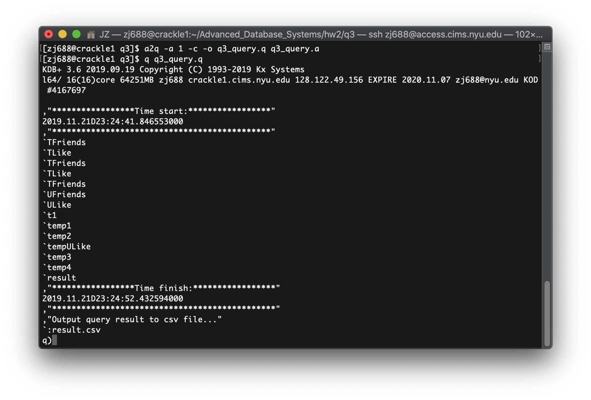

# Advanced Database Systems - Homework 2

### Team members:

- Zheng Jiang, Net ID: zj688
- Shih-Yao Chou, Net ID: syc574

<br/>

## Question 1

### Generate data

- Run `trade_gen.py` to generate data which will be stored in `trade.csv`.
- It takes me ~18min to generate 10,000,000 records on my MacBook Pro.

### Our queries using AQuery

See `q1/trade_query.a`.

### Run the queries

- Make sure you have installed `q`, `sbt`, and `java`
- Get [aquery's jar](https://drive.google.com/file/d/0B9IR8VjNetPYbWRIX0x2SEdoUGc/view)
  and put it in the same directory (`q1/`)
- Translate AQuery to q code by running:
  ```bash
  java -jar aquery.jar -a 1 -c -o trade_query.q trade_query.a
  ```
  Or if you've [wrapped the call to java and added it to your path](https://github.com/josepablocam/aquery#installationbuilding):
  ```bash
  a2q -a 1 -c -o trade_query.q trade_query.a
  ```
  This will generate `trade_query.q`.
- Run the queries:

  ```bash
  q trade_query.q
  ```

  You will get the following output in kdb+:

  ```
  `trade
  `trade
  `query_a
  `:query_a.csv
  `query_b
  `:query_b.csv
  `query_c
  `:query_c.csv
  `query_d
  `:query_d.csv
  q)
  ```

  Results of the four queries are stored in tables `` `query_a ``,
  `` `query_b ``, `` `query_c ``, and `` `query_d ``, respectively.
  Each table is also saved into a `csv` file.

  The prompt `q)` in the end means you are still in a q console session.

- To show the content of the query results, you can:
  - Show table in kdb+: ([kdb+ will truncate the display in height and width.
    You can set the size of the display using `\c` command.](https://code.kx.com/q4m3/13_Commands_and_System_Variables/#1314-console-c))
    ```
    q)query_a
    ...
    q)query_b
    ...
    q)query_c
    ...
    q)query_d
    ...
    ```
  - Exit the q session with `\\`, then view the `csv` files: [suggested]
    ```
    q)\\
    $ cat query_a.csv
    ...
    $ cat query_b.csv
    ...
    $ cat query_c.csv
    ...
    $ cat query_d.csv
    ...
    ```

<br/>

## Question 2

### The two rule of thumbs

1. Eliminate unnecessary DISTINCT

2. Leverage covering indexes  
   A covering index is a special case where the index itself contains the required data field(s) and can answer the required data.

### The two database systems

1. MySQL
2. KDB

### The two data distributions

1. Uniform distribution
2. Fractal distribution (we used the trades data generated from Question 1)

### The average time of the results

1. MySQL

|                        | Uniform Distribution | Fractal Distribution |
| ---------------------- | -------------------- | -------------------- |
| With Distinct          |                      |                      |
| Without Distinct       |                      |                      |
| With Covering Index    |                      |                      |
| Without Covering Index |                      |                      |

2. KDB

|                        | Uniform Distribution | Fractal Distribution |
| ---------------------- | -------------------- | -------------------- |
| With Distinct          | 885ms                | 1222ms               |
| Without Distinct       | 5ms                  | 6ms                  |
| With Covering Index    | 152ms                | 143ms                |
| Without Covering Index | 208ms                | 214ms                |

The query code we used are attached in `q2_query.a`.

<br/>

### 1). Eliminate unnecessary DISTINCT

The original query code used DISTINCT method as follows:

```
SELECT DISTINCT stocksymbol, time, quantity, price FROM trade;
```

<br/>

Firstly, we got the unique records with _stock symbol_, _time_, _qunatity_ and _price_ atrributes by using DISTINCT method. However, we noticed that it's unnecessary to have DISTINCT method since we've already selected the _time_ attribute which always produces an unique value.

Thus, we can remove the unneeded DISTINCT method and still get the same results through below query:

```
SELECT stocksymbol, time, quantity, price FROM trade;
```

According to the above results, we found that a query without using Distinct method can drastically reduce time for the both data distribution. (be applied to both MySQL and KDB)

However, the ratio of distinct and no-distinct time for KDB was ＿_, and the ratio for PostgreSQL was _＿, so we can find that without distinct can have a larger performance increase for KDB. Maybe KDB is not so good at doing some actions like distinct as at doing normal actions like queries and updates. Besides, because the KDB is a column oriented database, it's more difficult for KDB to do distinct actions. The distinct actions, especially for multi-columns comparison, is not the strong point of KDB, so it will take much more time than doing no-distinct actions.

At last, we can adjust the statement more precisely as follows:

It would be better to remove unnecessary Distict, since Distinct will significantly slow down the speed of a query, especially is applied to KDB, and avoid to use Distinct on multi-columns action while using KDB.

<br/>

### 2). Leverage covering indexes

The way to create a covering index is as follows:

- MySQL:

```
CREATE INDEX price_stocksymbol ON trade (price, stocksymbol);
```

- KDB:

```
`price`stocksymbol xkey `trade
```

<br/>

We followed the instruction from book, and made an index on (price, stocksymbol) contains the required data field and eliminates the need to look up the record. It not only avoids accessing the table to evaluate the where clause, but avoids accessing the table completely if the database can find the selected columns in the index itself.

If the table has a multiple-column index, any leftmost prefix of the index can be used by the optimizer to look up rows. However, MySQL cannot use the index to perform lookups if the columns do not form a leftmost prefix of the index. Thus, we make _price_ column in the leftmost prefix of the index (as the above SQL command) to make the below query effective:

```
SELECT stocksymbol FROM trade WHERE price > 100;
```

<br/>

According to the above results, we noticed that MySQL and KDB with covering index can both improve their query performance significantly. And this conclusion are applied to both data distributions. This is because having a covering index can let a query get the requested columns from the index without conducting a further lookup into the clustered index.

Therefore, we can adjust the statement as follows:

It would be better to leverage a covering index on the columns that we will query frequently so that we can improve performance significantly.

<br/>
<br/>

## Question 3

### Our query using AQuery and q

See `q3/q3_query.a`.

### Run the query

- Make sure the input data files are named `friends.csv` and `like.csv`
- Make sure you have installed `q`, `sbt`, and `java`
- Get [aquery's jar](https://drive.google.com/file/d/0B9IR8VjNetPYbWRIX0x2SEdoUGc/view)
  and put it in the same directory (`q3/`)
- Translate AQuery to q code by running:
  ```bash
  java -jar aquery.jar -a 1 -c -o q3_query.q q3_query.a
  ```
  Or if you've [wrapped the call to java and added it to your path](https://github.com/josepablocam/aquery#installationbuilding):
  ```bash
  a2q -a 1 -c -o q3_query.q q3_query.a
  ```
  This will generate `q3_query.q`.
- Run and time the queries:

  ```bash
  q q3_query.q
  ```

  **The start time and finish time will be printed at the beginning and the end of
  the query, respectively. Subtract them to calculate the time it took to execute
  the query.**

  **As shown in the example below, the query is executed in less than 11 seconds
  on the `crackle1.cims.nyu.edu` machine:**
  

- The result of the query is stored in table `result`.
  The table is also saved to a file named `result.csv`.
